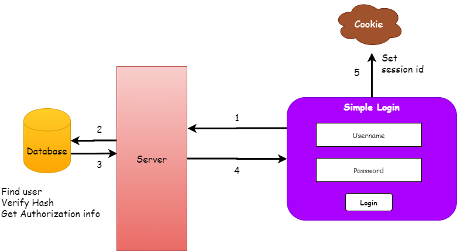
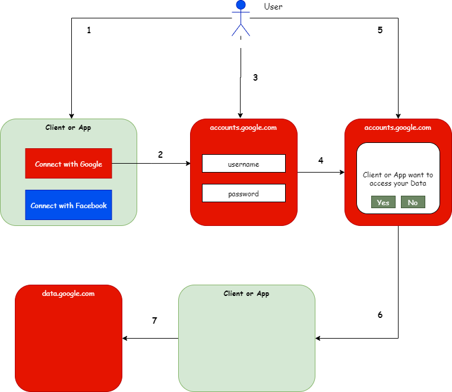
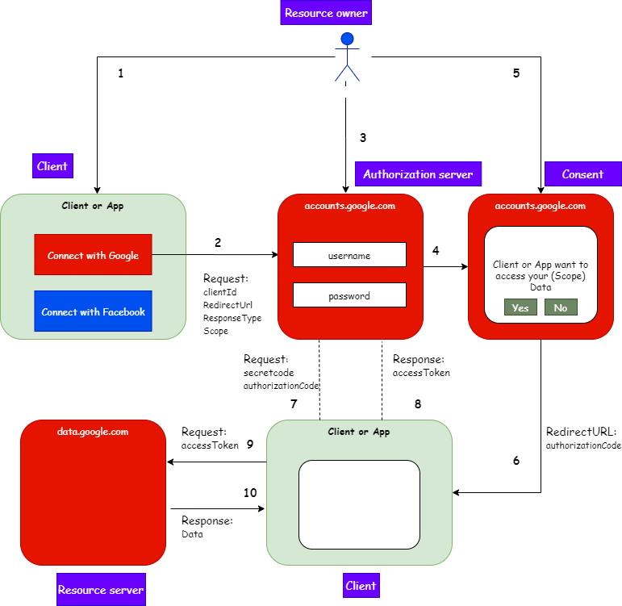
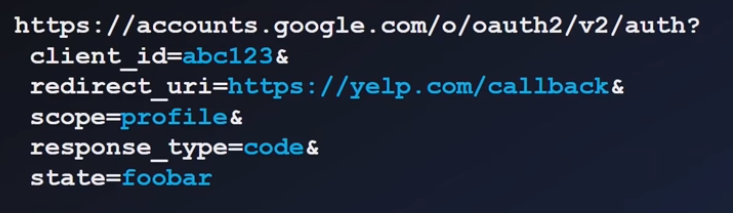

# OAuth2.0 and OpenId Connect  

## How authentication has evolved

### A basic simple login or Forms authentication

Above system has to 

* Store user info securely
* Hash password
* Maintain or change the hash algorithm
* Take care of maintanance of security of the system

The login mechanism has evolved and we have new scenarios like mobile apps and web apps which is described below:

# Use case for identity 

* Simple login - Using forms and cookies
* Single sign-on across sites - SAML
* Mobile app login - How to achieve ? Cannot have cookies and need a long live session
* Delegate authorization - How to give access without sharing a password ?

**The delegate authorization problem**

How can I let a website or client access my data without giving my password ?

How a typical authorization works today

## What is OAuth 2.0 ?

OAuth 2.0 is the industry-standard protocol for authorization

It solves the problem of delegated authorization

### OAuth 2.0 Terminologies

* **Resource owner**

One who owns the resource. 

If you have an account with Google or Facebook then you are the owner of these accounts and your data in it.

* **Client**

The application that needs the resource. 

It is the application(E.g Mobile app or Web app) that the resource owner uses which wants the data from the accounts(for e.g Google or facebook) of the resource owner.

* **Authorization server**

The system which grants the permission upon consent of the resource owner to access data (for e.g. accounts.google.com)

* **Resource server**

The system where the resources of the resource owner lie. 

It could be part of the Authorization server or it could be present seperately 

* **Authorization grant**

Its the permission given to the requesting client to access the data by means of an authorization code

* **Redirect URL**

Upon consent of the user it is the URL of the client that Authorization calls with the authorization code

* **Authorization code**

Code that the authorization server sends to the client upon successful authorization which is used by the client to get the access token

* **Access token**

The actual token which the client application needs to get the data from the resource server

## Why we need Authorization Code and Access token ?

Can we not pass the token directly to the Client ? 

Why do we have to send the autorization code and then the client again requests for the token ?

**Answer**

When the authorization server calls the *Redirect URL* with the authorization code, the call happens to be in the browser and typically the communication that happens in the front end is considered less secure or vulnerable to security issues even though we trust the browser to some extent

**Then doesn't the request to the access token also happen through the browser ?**

No. This actually is a server to server communication.
Which means the call is not happening from the client application but the client's server application which is secure and called as back channel.

**Client application <-------- calls ---------> Client Server <---------- communicates with ------------------> Authorization server**

### More OAuth 2.0 Terminologies

* **Back channel** (Highly secure chanel) ----> Client Server to Auth server communication

* **Front channel** (Less secure chanel) -----> Client to Auth server communication

In cases where the the client is a pure javascript or web application without any server application, then the front channel has to be used for fetching the access token.

## OAuth 2.0 Flows

OAuth 2.0 can be configured for different types of flows based on the type of security needed and application type.

# Authorization code flow

In this flow the **authorization code** is transferred by the **front channel** and the **token exchange** happens through the **back channel**

# Implicit flow

In this flow the token is fetched directly through the **front channel** without the authorization code

Here **ResponseType:Token** instead of code

