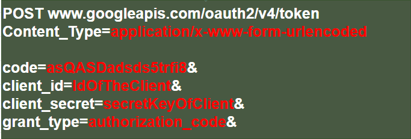
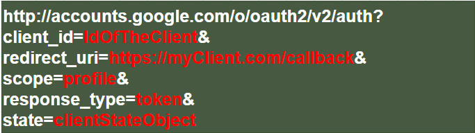
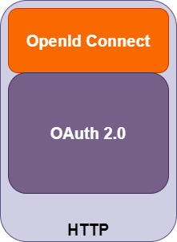
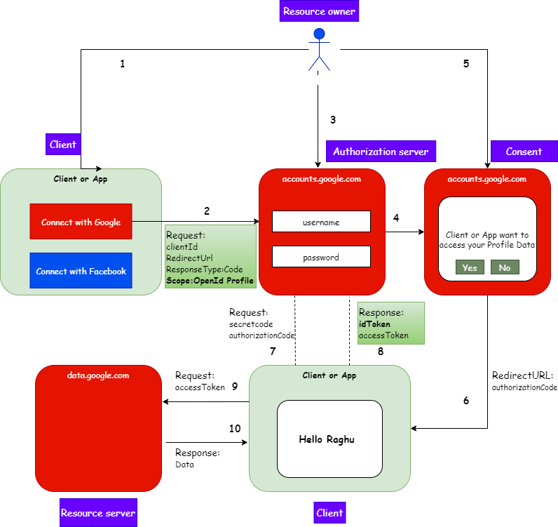

# How I understood OAuth2.0 and OpenId Connect  

## The evolution of authentication

Lets look at how a classic or simple login system works:

### A basic simple login or Forms authentication

Above system has to 

* Store user info securely
* Hash password
* Maintain or change the hash algorithm
* Take care of maintanance of security of the system

That was a very basic system of the past.

Today, the systems have evolved with the invent of mobile apps and modern web apps 

Below are the uses cases for identity we have today:

* Simple login - Using forms and cookies
* Single sign-on across sites - SAML
* Mobile app login - How to achieve ? Cannot have cookies and need a long live session
* Delegate authorization - How to give access without sharing a password ?

The deledate authorization problem is the one we will be stressing on more now to understand **OAuth**.

## The delegate authorization problem

How can I let a website or client access my data without giving my password ?

Lets look at how authorization is delegated:

## What is OAuth 2.0 ?

OAuth 2.0 is the industry-standard protocol for authorization

It solves the problem of delegated authorization.

There are quite a few terminologies used and understanding them makes it simple to go forward.

### OAuth 2.0 Terminologies

* **Resource owner**

One who owns the resource. 

If you have an account with Google or Facebook then you are the owner of these accounts and your data in it.

* **Client**

The application that needs the resource. 

It is the application(E.g Mobile app or Web app) that the resource owner uses which wants the data from the accounts(for e.g Google or facebook) of the resource owner.

* **Authorization server**

The system which grants the permission upon consent of the resource owner to access data (for e.g. accounts.google.com)

* **Resource server**

The system where the resources of the resource owner lie. 

It could be part of the Authorization server or it could be present seperately 

* **Authorization grant**

Its the permission given to the requesting client to access the data by means of an authorization code

* **Redirect URL**

Upon consent of the user it is the URL of the client that Authorization server calls with the authorization code

* **Authorization code**

Code that the authorization server sends to the client upon successful authorization which is used by the client to get the access token

* **Access token**

The actual token which the client application needs to get the data from the resource server

* **Scope**

The part or section of the Resource that the client needs access to (For e.g. Images or contacts or profile from Google)
What kind of right he needs(For e.g. read or write access -- Not sure if this is part of scope

With the terminologies in mind lets look at the authorization workflow again and understand the flow:

> **Why we need both Authorization Code and Access token ?**

> Can we not pass the token directly to the Client ?

> Why do we have to send the autorization code and then the client again requests for the token ?

> **Answer**

> When the authorization server calls the *Redirect URL* with the authorization code, the call happens to be in the browser and typically the communication that happens in the front end is considered less secure or vulnerable to security issues even though we trust the browser to some extent

> **Doesn't the request to the access token also happen through the browser ?**

> No. This actually is a server to server communication.
> Which means the call is not happening from the client application but the client's server application which is secure and called as back channel.

> **Client application <-------- calls ---------> Client Server <---------- communicates with ------------------> Auth server**

### More OAuth 2.0 Terminologies

* **Back channel** (Highly secure chanel) ----> Client Server to Auth server communication

* **Front channel** (Less secure chanel) -----> Client to Auth server communication
In cases where the the client is a pure javascript or web application without any server application, then the front channel has to be used for fetching the access token.

* **PKCE** Proof key for code exchange ------> This is the code(**secret code**) that the client server will send during a back channel request along with the authorization code to get the access token.
It provides an additionall level of security as anybody who intercepts the authorization code will not be able to fetch the access token.

## OAuth 2.0 Flows

OAuth 2.0 can be configured for different types of flows based on the type of security needed and application type.

### Authorization code flow

In this flow the **authorization code** is transferred by the **front channel** and the **token exchange** happens through the **back channel**

Request for Authorization code:

Request for token:

  

### Implicit flow

In this flow the token is fetched directly through the **front channel** without the authorization code

Here query parameter would be **response_type=token** instead of code

## Abuse of OAuth2.0 or short comings

OAuth2.0 according to specification was only for Authorization and was never meant for Authentication

However, due to its popularity it was used even for authentication as highlighted in cases below:

* Simple login - **Authentication**
* Single sign-on across sites - **Authentication**
* Mobile app login - **Authentication**
* Delegate authorization - **Authorization**

Different organizations started to build a **custom layer/implementation** of their own to achieve their use cases for Authentication.

We can call them **hacks** as they were usign OAuth under the hood

For e.g. [Login with facebook] or [Log in with Google] buttons]

> **Why cant I use it for Authentication?**

> The main reason is there no starndard way of returning the user information( like name or emailID etc) of the person who logged in.

> There were not many common scopes.

**OpenId Connect** was born as a result to fill the gap that OAuth2.0 had, which standardizes Authentication
 
## Open Id Connect

OpenID Connect 1.0 is a simple identity layer on top of the OAuth 2.0 protocol.

It allows Clients to verify the identity of the End-User based on the authentication

* OpenId Connect is for Authentication
* OAuth 2.0 is for Authorization

**What OpenId Connect brings to the table?**

* ID Token
* User info endpoint to get more user information
* Standard set of scopes
* Standardized Implementation

**How to make this request?**

It is the same as the OAuth code flow shown above.

We just add an additional **scope** *Open Id* in the request. 

It then becomes an OAuth(Authorization) and Open Id(Authentication) request

Refer to the Request/Response highlighted in green in the diagram below:

## Summary

Use OAuth for:

* Granting access to your Api
* Getting access to user data in other system

Use Open Id Connect for:

* Logging the user in
* Making your accounts available in other systems

Which flow to use:

* Web application with a backend server - Use Authorization code flow
* Native mobile application - User Authorization code flow with PKCE
* Javascript app with server backend - Use implicit flow
* Microservices and API - Use client credentials flow

## Note
I have not detailed the http Request/Response in a greter detail here to keep it simple which I plan to study and write up in future

## References

I started off with the below Pluralsight courses

**Introduction to OAuth2.0, OpenId Connect and JSON Web Token(JWT) by Dominick Baier**

I was overwhelmed with the terminologies and details.

Then I went ahead with the below course which I stopped half way through as I badly now wanted to understand the basics:

**Securing ASP.NET Core 2 with OAuth2.0 and OpenID Connect by Kevin Dockx**

I searched for more simple blogs and videos that would make me understand the concepts and then I stumbled upon this **life saver** video by **Nate Barbettini**:

https://www.youtube.com/watch?v=996OiexHze0

Most of my write up here is based or inspired by this video

So my suggestion is to first look at this video and then start the pluralsight or other courses

Other links:

https://www.oauth.com/

https://jwt.io/

https://openid.net/connect/

